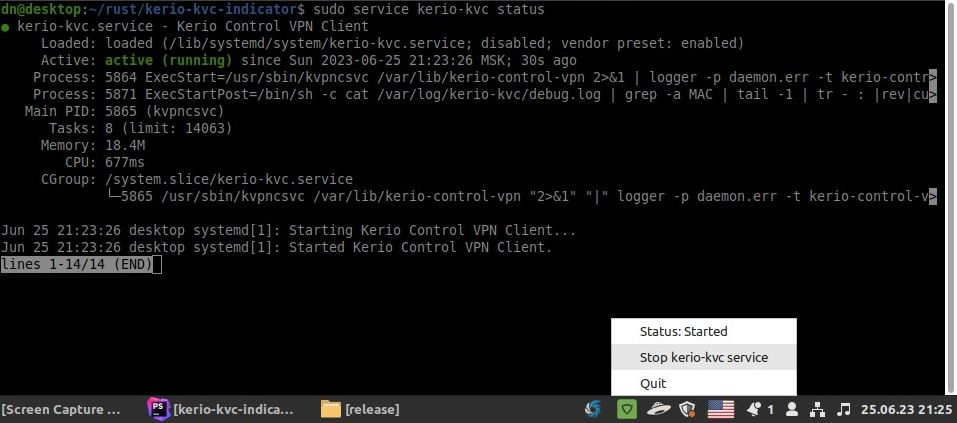

# Kerio-kvc-indicator

Tray icon indicator to manage the Kerio VPN client on Linux.



## Build from source

Clone source:
```bash
git clone git@github.com:dnovikov32/kerio-kvc-indicator.git
```

Install [TAO dependencies](https://github.com/tauri-apps/tao): 
```bash
sudo apt install libgtk-3-dev ibayatana-appindicator3-dev
```

Create build:
```bash
cargo build --release
```

Run from here:
```
./target/release/kerio-kvc-indicator
```

Tested only on Linux Mint 21.1 Cinnamon

